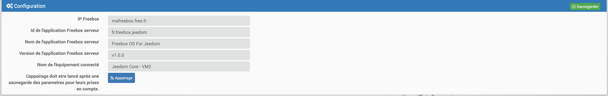
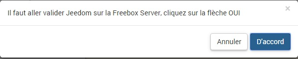
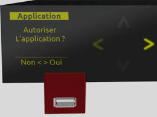
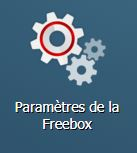
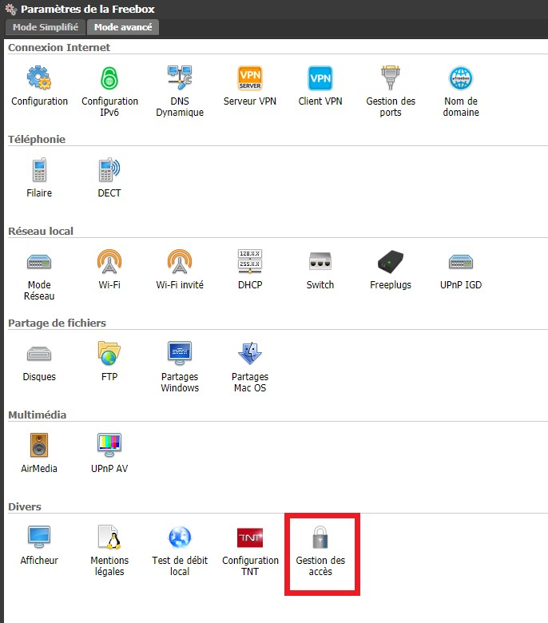
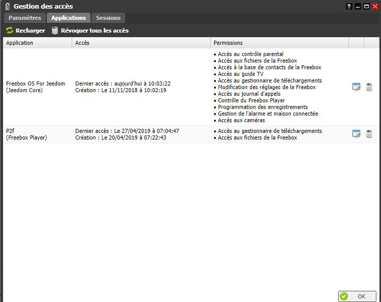
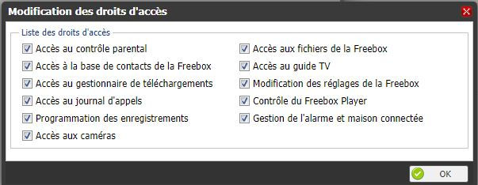
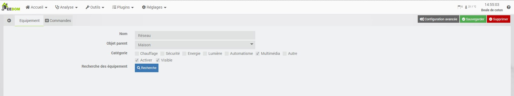
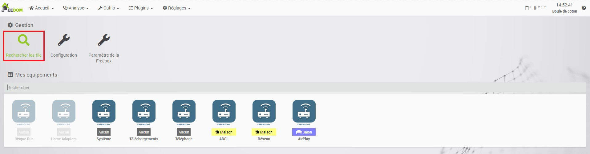
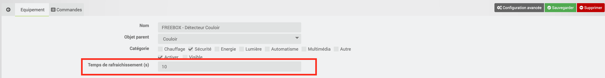

Description
==========
Ce plugin permet de récupérer les informations de votre freeboxOS (Serveur Freebox Révolution ou 4K ou DELTA).

Les informations disponibles de votre Freebox Serveur sur Jeedom sont:

* Les informations système :
    * Couper le wifi
    * Redémarrer votre Freebox
    * Les débits internet
     * L'état de votre connexion
* Téléphone :
    * Le nombre d'appels en absences
    * Le nombre d'appels passés
    * Le nombre d'appels reçus
* Disque Dur :
    * La place disponible dans vos disques connectés à la Freebox Serveur.
* Réseau :
    * L’état de chaque équipement DHCP
* Domotique (uniquement pour la DELTA) :
    * Récupère les infos de la maison connecté

Installation et Configuration
=============================
Une fois le plugin installé et activé, nous devons procéder à un appairage du serveur Jeedom sur la Freebox.

Sur la page de configuration, vous avez la possibilité de personnaliser les options de connexion, mais seules celles par défaut ont été validées.

* IP Freebox: Adresse de connexion de la Freebox (par défaut : mafreebox.free.fr)
* Id de l'application Freebox serveur: Identifiant utilisé par la Freebox (par défaut : fr.freebox.jeedom)
* Nom de l'application Freebox serveur: Nom utilisé par la Freebox (par défaut : Freebox OS For Jeedom)
* Version de l'application Freebox serveur: Version de l'application utilisé par la Freebox  (par défaut : v1.0.0)
* Nom de l'équipement connecté: Nom de l'équipement utilisé par la Freebox  (par défaut : Jeedom Core)
L'appairage doit être lancé après une sauvegarde des paramètres pour leurs prises en compte.

Appairage
=========
Pour cela, il suffit de cliquer sur le bouton "appairage" dans votre interface de configuration.
Vous allez à ce moment avoir un message comme ceci.
Ne validez surtout pas maintenant, attendez les étapes suivantes.

Validation sur la Freebox
-------------------------
Vous avez donc demandé à votre Freebox une nouvelle connexion par l'api, et il faut donc l'autoriser.
Pour cela, rien de plus simple, il vous faut donc aller valider cette connexion directement sur votre Freebox en appuyant sur la flèche de droite pour répondre "oui"

Validation Jeedom
-----------------
Vous pouvez donc maintenant retourner sur votre pc pour valider le message laissé en attente précédemment.
L'état de fonctionnement de la liaison va alors être testé.

Droit d'accès
=============

Certains droits d'accès sont nécessaires pour l'utilisation du plugin, ils doivent être modifier directement depuis l'OS de la Freebox
Il est donc nécessaire de modifier les droits d'accès dans la Freebox.

* Se connecter à l'interface de la Freebox (http://mafreebox.free.fr)
* Ouvrir le paramètre Freebox

* Ouvrer la gestion des accès de la Freebox

* Cliquer sur Applications
* Dans la liste, choisir l'Application déclaré lors de l'installation du Plugin (par défaut : Jeedom Core)

* Autoriser tout

Équipements
===========

Le plugin va automatiquement crée tous les équipements et les commandes dont il est capable d'exécuter ou de récupérer des informations
* ADSL
    * Freebox rate down
    * Freebox rate up
    * Freebox bandwidth up
    * Freebox bandwidth down
    * Freebox medi
    * Freebox state
* Système
    * Update
    * Reboot
    * Statut du wifi
    * Active/Désactive le wifi
    * Wifi On
    * Wifi Off
    * Freebox firmware version
    * Mac
    * Vitesse ventilateur
    * temp sw','temp_sw
    * Allumée depuis
    * board name
    * temp cpub
    * temp cpum
    * serial
    * Redirection de ports
* Téléphone
    * Nombre Appels Manqués
    * Nombre Appels Reçus
    * Nombre Appels Passés
    * Liste Appels Manqués
    * Liste Appels Reçus
    * Liste Appels Passés
    * Faire sonner les téléphones DECT
    * Arrêter les sonneries des téléphones DECT
* Téléchargements
    * Nombre de tâche(s)
    * Nombre de tâche(s) active
    * Nombre de tâche(s) en extraction
    * Nombre de tâche(s) en réparation
    * Nombre de tâche(s) en vérification
    * Nombre de tâche(s) en attente
    * Nombre de tâche(s) en erreur
    * Nombre de tâche(s) stoppée(s)
    * Nombre de tâche(s) terminée(s)
    * Téléchargement en cours
    * Vitesse réception
    * Vitesse émission
    * Start DL
    * Stop DL
* AirPlay
    * Player actuel AirMedia
    * AirMedia Start
    * AirMedia Stop
    
Spécificité de Home Adapters (Uniquement Freebox Delta), Réseau et Disque Dur
--------------------------------------------------

Ces 3 équipements ont pour spécificité d'être vide à la création.
Cela vient du fait qu'il faut se connecter à la box pour récupérer les commandes associées.
Vous y trouverez dans chacun d'entre eux un bouton "Rechercher" qui créera les commandes associées

Freebox Delta
=============

La Freebox Delta permet d'avoir un pack de sécurité ainsi que la connexion avec certain équipement.
Pour qu'il soit remonté et fonctionnel dans le plugin il suffit de cliquer sur "Rechercher les tiles"

> les camera sont créés, avec votre accord, dans le plugin camera, s'il existe.

Récurrence de la mise à jour des équipements
============================================

Il est possible de modifier le temps de rafraichissement de chaque équipement. Par défaut, le temps est de 300s.
Plus le temps est cours, plus il y aura de la charge sur la CPU de la Freebox.

ChangeLog
=========

Beta
----

Stable
------

### 10/12/2019

* Restructuration de la class API
* Creation d'un cron de rafraichissement du tocken pour avoir qu'une seul session
* Mise a jours du widget Reseau

### 27/11/2019

* Ajout des widgets pour la partie mobile
